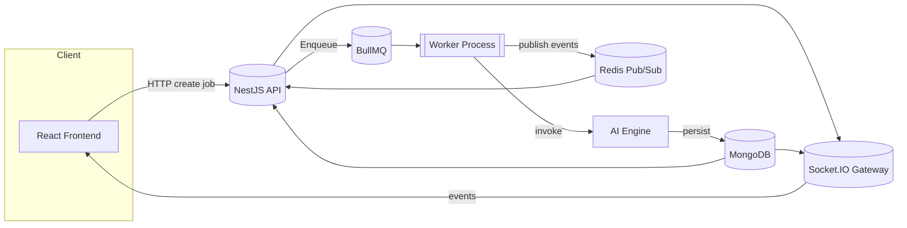
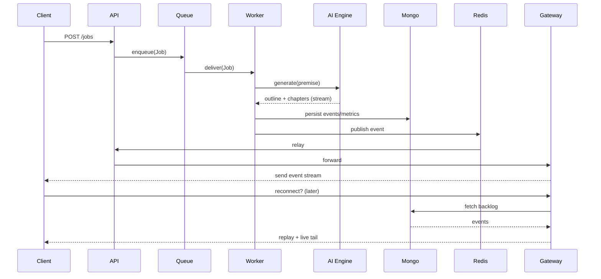
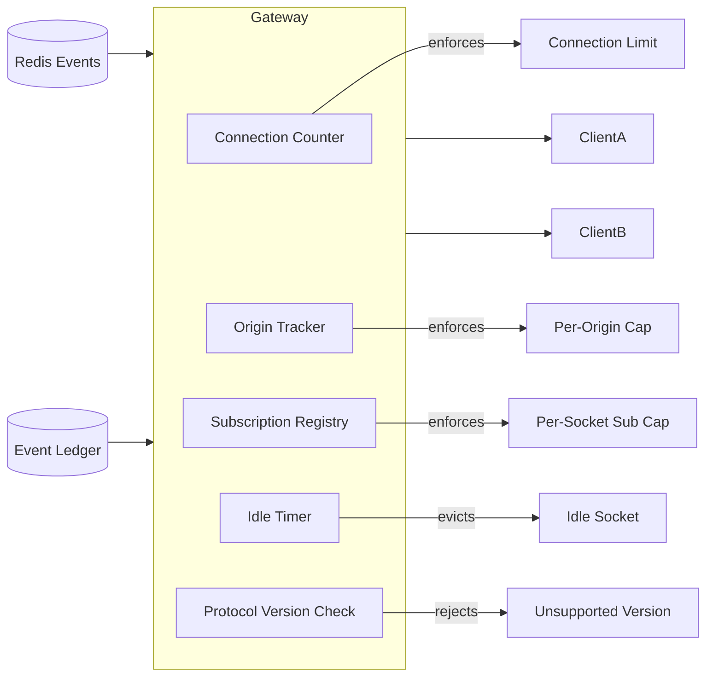

# LetsWriteABook Rebuild Teaching Brief (Architecture & Execution Chronicle)

**Last Updated:** 2025-10-06  \\
**Maintainers:** Project Manager & Tech Lead (Documentation treated as code)

> This document is named “gamma-teaching-brief” only because it can be fed to an AI document generator. Its true purpose is to be the canonical, richly detailed narrative of the LetsWriteABook application: where it came from, what it does, how it is being rebuilt, and why each technical decision exists. It should stand entirely on its own without any knowledge of the tooling used to render it.

---

## Table of Contents

1. [Purpose & Scope](#purpose--scope)
2. [Product Origin & Evolution](#product-origin--evolution)
3. [Current Product Definition](#current-product-definition)
4. [Rebuild Objectives & Constraints](#rebuild-objectives--constraints)
5. [High-Level Architecture](#high-level-architecture)
6. [Domain Model & Core Entities](#domain-model--core-entities)
7. [Generation Lifecycle (End-to-End Flow)](#generation-lifecycle-end-to-end-flow)
8. [Phase Chronicle (Execution Story)](#phase-chronicle-execution-story)
   - 8.1 Phase 1 — Baseline Capture & Safety Nets
   - 8.2 Phase 2 — Monorepo Scaffolding & Tooling
   - 8.3 Phase 3 — AI Engine Extraction
   - 8.4 Phase 4 — Application Skeleton (API + Worker)
   - 8.5 Phase 5 — Persistence Layer Refactor
   - 8.6 Phase 6 — Messaging & Realtime Layer
   - 8.7 Phases 7–11 — Remaining Roadmap
9. [Technology Deep Dives](#technology-deep-dives)
   - TypeScript, pnpm, Turborepo, Vite
   - NestJS, BullMQ, Socket.IO
   - MongoDB, Typegoose, migrate-mongo
   - Redis (Queue + Pub/Sub)
   - Testing Stack & Quality Controls
10. [AI Engine Internals](#ai-engine-internals)
11. [Persistence Layer Details](#persistence-layer-details)
12. [Messaging & Realtime Mechanics](#messaging--realtime-mechanics)
13. [Testing & Quality Strategy](#testing--quality-strategy)
14. [Operational Concerns](#operational-concerns)
15. [Security & Planned Observability](#security--planned-observability)
16. [Risks & Mitigations](#risks--mitigations)
17. [Near-Term Roadmap & Exit Criteria](#near-term-roadmap--exit-criteria)
18. [Glossary](#glossary)
19. [Cross References](#cross-references)
20. [Appendix: Optional AI Generation Prompt](#appendix-optional-ai-generation-prompt)

---

## Purpose & Scope

This brief is the authoritative educational artifact for the LetsWriteABook rebuild. It should allow a motivated engineer, product owner, or technical writer—without prior exposure—to reconstruct:

* What the product does for end users.
* Why a rebuild was necessary.
* How each subsystem (AI, persistence, realtime, worker orchestration) functions independently and in concert.
* The rationale behind every foundational tool selection.
* Future trajectory and gating criteria for delivery phases.

It intentionally excludes marketing language and frontend UX detail (that will be documented once Phase 7 begins) but it fully captures the *engine room* of the platform.

---

## Learning Mode: Vibe-Coding Orientation

This brief is also optimized for a student practicing **high-quality vibe coding**—a disciplined flow state where you:

* Maintain momentum (minimal friction in tooling) while preserving correctness gates.
* Alternate between exploratory spikes and consolidation (refactor + document + test) cycles.
* Let ambient signals (type errors, failing golden tests, load harness deltas) nudge you, rather than context switching to dashboards.
* Keep architecture sketches lightweight but updated (Mermaid, ASCII) so mental models stay shareable.

### Core Vibe-Coding Principles Applied Here

| Principle | Manifestation in This Rebuild |
|-----------|--------------------------------|
| Tight Feedback Loops | Golden tests + integration suites run fast; Turborepo caching accelerates reruns. |
| Progressive Disclosure | Complex subsystems (AI engine, realtime) isolated behind packages before deep dives. |
| Rhythm of Explore → Solidify | Each phase ends with docs + tests updated before starting the next phase. |
| Externalized Mental State | Architecture & lifecycle diagrams (see instructions later) live in repo, not whiteboards. |
| Guardrails over Policing | Lint/type/env scripts auto-enforce; humans focus on creative domain & clarity. |

### Suggested Study Path (Student Track)

1. Skim: High-Level Architecture & Domain Model.
2. Read: Phase Chronicle to understand sequencing logic.
3. Dive: AI Engine Internals + Messaging & Realtime.
4. Practice: Recreate the Generation Lifecycle diagram from memory, then compare.
5. Extend: Add a mock stage (e.g., "style calibration") locally—do NOT commit—observe golden test failure patterns.
6. Reflect: Write a short journal entry (commit message draft) summarizing what surprised you.

Use this rhythm to build *intuition + discipline* simultaneously.

---

## Product Origin & Evolution

The original LetsWriteABook application began as a pragmatic tool to convert a creative prompt into a structured novel draft. Its earliest architecture centered on:

* Direct OpenAI API calls embedded inside a monolithic code path.
* Ad-hoc persistence of job state in Mongo without a formal repository abstraction.
* WebSocket broadcasting with minimal protocol versioning and limited guardrails.
* Sparse regression testing—behavioural drift risked silent regressions.

As feature requests accumulated (richer outline structure, chapter-by-chapter streaming, cost transparency, continuity enhancements), technical debt compounded. The system required:

1. **Isolation of AI logic** to enable experimentation without destabilizing shipping behaviour.
2. **Deterministic reproducibility** so output parity could be asserted after internal refactors.
3. **Robust realtime layer** to handle connection churn, replay missed progress, and enforce quotas.
4. **Structured persistence** that normalized metrics, events, and metadata while supporting historical backfill.

The rebuild answers those pressures through a phased modernization while preserving fidelity to existing creative outputs.

---

## Current Product Definition

At its core, the product turns a *premise* (genre + tone + audience + seed concept) into:

1. A refined premise analysis.
2. A hierarchical outline with chapters/scenes.
3. Iteratively generated chapter prose consistent with the outline.
4. Supplemental metadata: token usage, cost metrics, continuity hints, story bible fragments.
5. A realtime event stream clients can observe to watch progress unfold.

The user value proposition: *Transparent, structured, and guided long-form AI-assisted writing with reproducibility guarantees.*

---

## Rebuild Objectives & Constraints

See also `REBUILD_EXECUTION_PLAN.md` (authoritative). Summarized here for instructional continuity:

**Objectives**
* Functional parity for AI outputs and realtime events.
* Improved modularity enabling parallel development (AI vs UI vs infra).
* Foundation for future model diversification or fine-tuning.

**Key Constraints**
* Legacy prompt text and sequencing remain unchanged unless versioned.
* Public event payload shapes remain backward compatible until formal deprecation.
* All code TypeScript-first with strict mode.

---

## High-Level Architecture

Logical tiers:

| Tier | Responsibility | Representative Components |
|------|----------------|---------------------------|
| Presentation | (Upcoming) React frontend consuming REST + WebSocket APIs | Vite app (Phase 7) |
| API Layer | Validates requests, exposes job read models, relays realtime updates | NestJS API (`apps/api`) |
| Worker Layer | Orchestrates novel generation; streams domain events | BullMQ Worker (`apps/worker`) |
| AI Engine | Deterministic pipeline of stages producing creative artefacts | `@letswriteabook/ai-engine` |
| Persistence | Durable storage of jobs, events, metrics, metadata | `@letswriteabook/persistence` (Mongo) |
| Messaging | Event contracts + realtime gateway + Redis transport | `@letswriteabook/messaging`, Socket.IO gateway |
| Infrastructure | Tooling, CI, migration framework, environment validation | Turborepo, pnpm, migrate-mongo |

Runtime flow (simplified):

Client → API (create job) → Queue (BullMQ) → Worker → AI Engine (stages) → Persistence (repositories) → Redis publish → API subscriber → Socket.IO gateway → Client (events)

### Diagram Instructions (Create & Maintain)

Place rendered diagrams (PNG/SVG) under `docs/assets/architecture/` with matching Mermaid source under `docs/assets/architecture/source/` so diffs remain text-reviewable.

1. Create folder if missing: `docs/assets/architecture/{source,rendered}`
2. Store Mermaid as `*.mmd` (one diagram = one file).
3. Export PNG/SVG using VS Code Mermaid extension or `mmdc` (Mermaid CLI) and commit both.
4. Reference diagrams in this doc using relative paths.

#### Mermaid: High-Level Component Map (`high-level.mmd`)


#### Mermaid: Generation Lifecycle (`generation-lifecycle.mmd`)


#### Mermaid: AI Engine Stages (`ai-engine-stages.mmd`)
```mermaid
flowchart TD
   A[Premise Analysis] --> B[Outline Generation]
   B --> C{Chapters Loop}
   C -->|Chapter i| D[Generate Chapter]
   D -->|Retry w/Backoff?|
   D -->|Success| E[Accumulate Metrics]
   E -->|All Chapters Done| F[Finalize Job]
```

#### Mermaid: Realtime Guardrails (`realtime-guardrails.mmd`)


---

## Domain Model & Core Entities

| Entity | Purpose | Key Fields |
|--------|---------|-----------|
| Job | Top-level novel generation request | id, status, premise, outlineRef, metricsRef, createdAt |
| Outline | Structured chapter hierarchy | jobId, chapters[], revisionMeta |
| Chapter | Individual generated unit | index, title, body, tokenUsage, costBreakdown |
| Event | Realtime-worthy milestone | jobId, type, payload, createdAt, sequence |
| Metrics | Aggregated cost/performance | jobId, totalTokens, totalCost, latencyStats |
| Metadata | Continuity + story bible | jobId, entities, locations, styleVectors |

Events are append-only, forming the authoritative ledger for replay.

---

## Generation Lifecycle (End-to-End Flow)

1. **Submission**: Client POST triggers job creation; job enters `queued`.
2. **Queue Dispatch**: BullMQ schedules job; worker claims it.
3. **Premise Analysis Stage**: AI engine refines premise → emits `premise.analyzed` event.
4. **Outline Stage**: Structured outline produced (+ snapshot persisted) → events for each chapter stub.
5. **Chapter Generation Loop**: For each outline entry: generate body with retries & cost tracking → emit progress and completion events.
6. **Metrics Aggregation**: Token and cost numbers rolled into metrics document.
7. **Finalization**: Job status transitions to `completed` (or failure path with reason), final event emitted.
8. **Replay**: A late-joining client requests catch-up; gateway queries persisted events and streams them sequentially before live tailing.

---

## Phase Chronicle (Execution Story)

Below each phase emphasises *why* as much as *what*.

### Phase 1 — Baseline Capture & Safety Nets
**Why This Phase Exists**: You cannot improve what you cannot *prove* you haven’t broken. Phase 1 converts the legacy application’s implicit behaviour into explicit, executable evidence.

**Core Actions**
| Action | Description | Artifact |
|--------|-------------|----------|
| Prompt Inventory | Exported every legacy prompt template (premise, outline, chapter) and system modifier text | `packages/ai-engine/src/prompts/*` |
| Golden Test Harness | Created snapshot + structured comparison tests for outline, chapters, costs, event sequencing | `packages/ai-engine/src/__tests__/golden/*` |
| Legacy Snapshot Fixtures | Captured representative full job (success + failure) with token/cost/event ledger | `golden-tests/fixtures/*` |
| Contract Drafting | Began enumerating WebSocket event names + payload skeletons for later formalization | `docs/contracts/websocket.md` (initial) |
| Environment & Config Capture | Backed up env var usage, added reference doc skeleton | `docs/config/environment-reference.md` |

**Signals of Done**
* Golden suite passes consistently (provides red/green cycle under <10s typical on warmed cache).
* Any attempt to tweak prompt wording triggers a snapshot diff.

**Student Practice (Vibe-Coding Exercise)**
Clone the repo, intentionally alter a single prompt token (e.g., change a phrase). Run tests and observe the diff noise. Revert. Internalize how *fast* feedback deters accidental drift.

**Transition Rationale**
With behaviour frozen, later architectural refactors (extraction, modularization) become *mechanical*, not speculative.

---

### Phase 2 — Monorepo Scaffolding & Tooling
**Why**: Provide a scalable workspace that *accelerates* rather than burdens iterative change; install automatic correctness rails early.

**Key Implementations**
| Capability | Outcome | Files |
|------------|---------|-------|
| Turborepo + pnpm Workspaces | Shared caching + dependency graph aware task orchestration | `turbo.json`, `pnpm-workspace.yaml` |
| Strict TypeScript Baseline | Enforced `strict` + path references | `tsconfig.base.json` |
| Lint + Format Enforcement | Consistent style, error surfacing pre-commit | `.eslintrc.cjs`, `.prettierrc`, Husky hooks |
| Conventional Commits | Machine-parseable history | `commitlint.config.cjs` |
| Env Alignment Script | Prevents drift between docs and examples | `scripts/check-env-alignment.ts` |
| CI Pipeline | Deterministic PR gating | `.github/workflows/ci.yml` |

**Impact**
Developers spend less cognitive load on setup/config, more on domain modelling.

**Student Practice**
Add a benign TypeScript interface mismatch; watch `pnpm test` + editor diagnostics guide a fix. Note how friction remains low.

**Transition**
We now possess a safe chassis to *host* extracted logic (Phase 3).

---

### Phase 3 — AI Engine Extraction
**Why**: Segregate creative generation logic from orchestration/transport so future experimentation (model variants, caching, style tuning) is decoupled from delivery concerns.

**Structural Moves**
| Element | Purpose | Location |
|---------|---------|----------|
| Stage Interfaces | Formal contract for sequential pipeline steps | `ai-engine/src/stages/*` |
| Client Abstraction | Facilitate mock vs OpenAI vs future providers | `ai-engine/src/clients/*` |
| NovelGenerationEngine | Orchestrates premise → outline → chapters with hooks | `ai-engine/src/engine.ts` |
| Event Emission Hooks | Allows external realtime pipeline to subscribe | Engine options object |
| Retry & Cost Accounting | Centralized logic with deterministic accumulation | `ai-engine/src/runtime/*` |

**Determinism Tactics**
* Functional boundaries (pure prompt builders) separated from side-effectful network calls.
* Golden tests target public API only (`generateNovel`) to discourage secret coupling.

**Student Practice**
Simulate a transient failure by throwing in chapter generation; observe retry path and final status propagation in tests.

**Transition**
With engine isolated, we can embed it inside worker processing (Phase 4) without tangling concerns.

---

### Phase 4 — Application Skeleton (API + Worker)
**Why**: Establish runtime topology early; prove vertical slice from job submission to staged generation without full persistence sophistication.

**Implemented**
| Component | Responsibility | Notes |
|----------|----------------|-------|
| Health Controller | Reports Mongo/Redis readiness | Adds future slot for AI provider health |
| Job Enqueue Endpoint (scaffold) | Accept request → push queue | Validation placeholder (Zod/class-validator candidate) |
| Worker Bootstrap | Connect to Redis, process queue with engine | Graceful shutdown handlers added |
| Logging Baseline | Structured console output w/ job correlation IDs | To be extended in Phase 8 |

**Quality Gates**
* Unit tests stub network.
* Worker processor tests assert event ordering & error path shutdown.

**Student Practice**
Add a dummy queue job manually via Redis CLI; tail logs; map output to lifecycle events list.

**Transition**
We now *exercise* the engine under process boundaries—time to persist durable state (Phase 5).

---

### Phase 5 — Persistence Layer Refactor
**Why**: Raw ad-hoc database writes degrade reliability and testability; a repository layer supplies consistent semantics and future transaction support.

**Repository Modules**
| Repo | CRUD Focus | Extra Behaviours |
|------|-----------|------------------|
| Jobs | Create, status transitions | Idempotent finalize, optimistic checks |
| Events | Append-only ledger | Sequence assignment, pagination hooks |
| Metrics | Aggregate token/cost/time | Incremental deltas, reset semantics |
| Metadata | Story bible & continuity | Merge patches, structure validation |

**Transactions**
Attempted when sessions available; fallback logs ensure awareness when atomicity is downgraded.

**Migrations**
TypeScript templated; enforced in CI. First migration: indexes + base collections.

**Student Practice**
Run migration down/up locally; inspect collections; add a test metric delta to understand accumulation.

**Transition**
Durable event ledger enables robust catch-up replay—prerequisite for realtime hardening (Phase 6).

---

### Phase 6 — Messaging & Realtime Layer
**Why**: Users must *watch* narratives unfold; reliability + fairness (quotas) preserve quality of experience under load spikes.

**Realtime Stack Components**
| Piece | Role |
|-------|-----|
| Messaging Package | Versioned event schemas + constructors |
| Redis Publisher | Emits worker events immediately |
| Redis Subscriber | Validates + forwards into gateway |
| Socket.IO Gateway | Manages connections, subscriptions, replay |
| Load Harness | Stress + regression instrumentation |

**Guardrails Implemented**
Connection quota, per-origin quota, per-socket subscription cap, idle eviction, protocol version check, replay ordering guarantees.

**Performance Baseline Goals** (target; actual metrics populated post Phase 6 completion)
| Metric | Target |
|--------|-------|
| Median Event Delivery | < 150 ms |
| P95 Delivery | < 400 ms |
| Catch-up Replay (100 events) | < 2 s |

**Student Practice**
Run the load harness locally with a reduced scenario size; deliberately raise connection limit thresholds and observe harness failure patterns.

**Transition**
Prepares surface for frontend consumption + observability layering.

---

### Phases 7–11 — Remaining Roadmap
| Phase | Focus | Key Additions |
|-------|-------|--------------|
| 7 | Frontend Rebuild | React + Vite app, websocket hooks, accessibility baseline, monitoring dashboard |
| 8 | Observability & Security | Metrics endpoints, tracing, CSP, auth for admin ops |
| 9 | Comprehensive QA | Side-by-side diff harness, E2E automation, performance regression suite |
| 10 | Deployment & Cutover | Infra reproducibility, blue/green or staged cutover rehearsal, rollback drills |
| 11 | Stabilization & Roadmap | Runbooks, incident templates, post-launch backlog triage |

**Student Macro Exercise**: Draft a speculative ADR for adding a "style calibration" pre-chapter stage. Include: intent, alternatives, risks, test impact. (Do not merge—learning only.)

---

---

## Technology Deep Dives

### TypeScript
Enforces structural contracts across packages; strict mode surfaces mismatches early, becoming living documentation.

### pnpm & Turborepo
`pnpm` content-addressed store reduces duplication. Turborepo graph awareness + caching keeps iterative feedback tight (critical during heavy phase work).

### Vite (Upcoming Frontend)
Selected for dev velocity (ESBuild/SWC underpinnings) and excellent TypeScript ergonomics. Its future integration will harness module graph hot updates for UI prototyping.

### NestJS
Provides a modular, DI-driven structure. Health checks, configuration modules, and controllers remain isolated and testable.

### BullMQ + Redis
Separation of concerns: queue semantics decouple API responsiveness from long-running generation. Redis chosen for ubiquity and low-latency pub/sub synergy with realtime layer.

### Socket.IO Gateway
Adds abstraction over WebSocket fallback semantics, simplifying origin checks, subscription caps, and replay injection.

### MongoDB + Typegoose + migrate-mongo
Document-appropriate for narrative artefacts. Typegoose reduces modeling boilerplate; migration framework guarantees deterministic schema evolution.

---

## AI Engine Internals

Stages (simplified):

| Order | Stage | Responsibility | Determinism Safeguards |
|-------|-------|----------------|------------------------|
| 1 | Premise Analysis | Expand/refine user premise | Golden snapshot prompts |
| 2 | Outline Generation | Structural plan creation | Outline snapshot + diff tests |
| 3..n | Chapter Generation Loop | Body text per chapter with retry/backoff | Per-chapter prompt snapshots |

Cross-cutting concerns: cost accounting, event publishing, structured logging, abort propagation.

---

## Persistence Layer Details

Repositories abstract collections: Jobs, Events, Metrics, Metadata. Transaction helper attempts multi-document atomicity when sessions (replica set) exist; falls back with idempotent partial writes & warnings.

Canonical operations:
* `appendEvent(jobId, event)`
* `updateMetrics(jobId, delta)`
* `upsertMetadata(jobId, patch)`
* `finalizeJob(jobId, status, summary)`

Migrations maintain idempotent collection/index creation; backfill tooling will transform legacy blobs into normalized structures.

---

## Messaging & Realtime Mechanics

Pipeline:
Worker → Redis pub channel → API subscriber (validation + version guard) → Gateway fan-out → Client(s).

Replay:
1. Client subscribes specifying job.
2. Gateway queries events by jobId ordered by sequence.
3. Streams backlog then enters live mode (tailing subscriber events).

Guardrails (enforced in gateway): connection quota, per-origin limits, subscription cap, idle eviction timer.

Latency Observability (planned): 95th percentile delivery latency and backlog replay duration exported via metrics endpoint.

---

## Testing & Quality Strategy

| Layer | Technique | Purpose |
|-------|----------|---------|
| AI Engine | Golden snapshots | Behaviour parity |
| Repositories | Integration (mongodb-memory-server) | Data correctness & transactions |
| API | Unit + controller tests | Contract stability |
| Realtime | Load harness scenarios | Guardrail verification |
| End-to-End (upcoming) | Playwright + side-by-side legacy diff | Full fidelity validation |

Continuous Integration blocks merges on lint, type, unit, integration, and env alignment scripts.

---

## Operational Concerns

**Environment Governance**: Single source at `docs/config/environment-reference.md`; automated drift checks via `pnpm config:lint-env`.

**Local Development**: Docker Compose for Mongo + Redis; `pnpm dev` to run API + worker using mock or real OpenAI depending on env variables.

**Deploy Targets**: Railway multi-service alignment (API, Worker, Redis, Mongo). Terraform/Infra docs (future) to codify reproducibility.

**Migrations**: Run automatically in CI before test; production migration gated by review + rollback plan.

---

## Security & Planned Observability

**Planned Enhancements (Phase 8)**:
* Structured logging (Pino) with correlation IDs.
* Metrics export (Prometheus format) for queue depth, generation duration, replay latency.
* OpenTelemetry tracing for API → Worker → AI Engine spans.
* Security: CSP headers, stricter CORS origin whitelist, token-based auth for admin endpoints, secret rotation policy.

---

## Risks & Mitigations

| Risk | Impact | Mitigation |
|------|--------|-----------|
| AI model drift despite unchanged prompts | Silent behavioural change | Golden tests + manual review gates |
| Realtime load bursts exceed quotas | Dropped connections | Proactive guardrails + load harness regression runs |
| Legacy data anomalies during backfill | Incomplete history | Validation scripts + dry-run diff reports |
| Migration mis-sequencing | Runtime failures | CI migration status + rollback scripts |
| Metrics under-instrumentation | Blind spots post-launch | Observability sprint (Phase 8) explicit exit criteria |

---

## Near-Term Roadmap & Exit Criteria

| Upcoming Phase | Primary Outcome | Exit Signal |
|----------------|-----------------|-------------|
| 6 (completion) | Guardrail + replay validation | Load harness JSON reports committed |
| 7 | Frontend parity React app | E2E passing + accessibility audit |
| 8 | Observability + security baselines | Dashboards + SLO doc + security checklist signed |
| 9 | Parity confirmation | Side-by-side diff suite green |
| 10 | Cutover readiness | Rehearsed rollback + dry run deploy |
| 11 | Stabilization | Runbooks & backlog triage log |

---

## Glossary

| Term | Definition |
|------|------------|
| Golden Test | Snapshot-based regression test freezing canonical outputs. |
| Catch-up Replay | Mechanism sending persisted backlog before live events. |
| Backfill | Process of transforming legacy stored data into new normalized schema. |
| Guardrail | Enforced operational limit (connections, subscriptions, origin). |
| Event Ledger | Append-only event collection enabling deterministic replay. |

---

## Cross References

- `REBUILD_EXECUTION_PLAN.md`
- `docs/qa/realtime-load-testing.md`
- `docs/contracts/websocket.md`
- `docs/persistence/migrations/README.md`
- `docs/CONTRIBUTING.md`

---

## Appendix: Optional AI Generation Prompt

> This section is purely auxiliary. Delete if distributing to humans directly. Paste into an AI document generator to produce a stakeholder-friendly narrative.

```
Title: LetsWriteABook Rebuild — Architecture & Execution Chronicle

Objective: Produce a clear, accurate narrative explaining the LetsWriteABook rebuild—its purpose, architecture, phase progress, and upcoming milestones—without instructing on how to use any document-generation tool.

Include Sections:
- Product Origin & Evolution
- Current Product Definition
- High-Level Architecture (table + prose)
- Generation Lifecycle (step list)
- Phase Chronicle (1–11 concise summaries, completed vs pending)
- Technology Rationale (TypeScript, pnpm, Turborepo, NestJS, BullMQ, Redis, Mongo/Typegoose, Socket.IO, migrate-mongo)
- AI Engine Internals (stages + safeguards)
- Persistence & Realtime Deep Dives
- Risks & Mitigations
- Upcoming Milestones & Exit Criteria

Tone: Professional, instructive, confident. Avoid marketing hype.
Word Target: ≤ 1,400 words.

End with a concise forward-looking statement about the frontend rebuild and observability phase.
```

---


## Technical Foundations Encyclopedia

This appendix-style section explains each major tool with the patience of a coach guiding students through their first capstone project.

### Languages & Tooling

#### TypeScript
TypeScript augments JavaScript with static types. It catches mismatched data before the code runs, improves editor autocompletion, and documents intent. By making types mandatory, we reduce runtime surprises.

#### Vite
Vite is a rapid development server and bundler. It leverages native ES modules, enabling near-instantaneous hot reloading during frontend work. When Phase 7 begins, Vite will make UI iteration feel effortless compared to older tooling.

#### pnpm
pnpm is our package manager. Unlike npm or Yarn, it stores dependencies in a content-addressed store, eliminating duplication and speeding up installs—ideal for large monorepos.

#### Turborepo
Turborepo orchestrates tasks across packages. It caches results and runs jobs in parallel when safe, ensuring `pnpm lint` and `pnpm test` finish quickly even as the codebase grows.

### Backend Frameworks & Services

#### NestJS
NestJS structures the API with modules, controllers, and dependency injection. It mirrors the design patterns of enterprise frameworks, making it approachable and testable.

#### BullMQ
BullMQ manages background work through Redis. It schedules jobs, handles retries, and exposes worker health metrics.

#### Socket.IO Gateway
The gateway is our realtime conductor. Clients subscribe to story rooms; the gateway enforces limits, streams events, and replays missed updates from Mongo. If the gateway were an orchestra director, it would ensure every instrument enters on cue.

### Data & Messaging Infrastructure

#### MongoDB
Mongo stores job documents, event logs, metrics, and metadata. Its document model suits narrative content, and with replica sets we gain ACID transactions for complex writes.

#### Redis
Redis serves two roles: the backing store for BullMQ queues and the pub/sub channel for realtime events. Its in-memory nature keeps latency low.

#### migrate-mongo
This CLI records schema changes as up/down scripts. CI runs migrations before tests, guaranteeing every environment stays aligned.

### Testing & Quality Guards

#### Golden Tests
Golden tests capture legacy outputs—outlines, chapters, cost summaries—and compare them against the new engine. When a difference appears, the team decides whether it’s an intentional improvement or a regression.

#### Integration Tests (mongodb-memory-server)
These tests spin up an ephemeral Mongo instance, run repository operations, and assert transactional behaviour. They prevent surprises when real databases are involved.

#### Realtime Load-Test Harness
The harness simulates clients connecting, subscribing, disconnecting, and receiving event bursts. It measures latency percentiles and ensures guardrails fire as expected.

---

## Process Playbooks & Rituals

### Golden Tests Explained

1. **Capture:** Record outputs from the legacy system.
2. **Freeze:** Store them as fixtures with strict typings.
3. **Compare:** Run new code and diff the outputs.
4. **Decide:** Accept intentional differences or fix regressions.

Like a lab notebook, golden tests ensure future experiments respect past discoveries.

### Load Testing Harness Walkthrough

- Located at `tooling/realtime-load-test/`.
- Scenarios: `connection-quota`, `origin-quota`, `subscription-cap`, `idle-eviction`, `catch-up-burst`, `broadcast-burst`.
- Example command:
  ```pwsh
  pnpm --filter @letswriteabook/realtime-load-test run -- --scenario broadcast-burst --origin http://localhost:5173 --redis-url redis://localhost:6379
  ```
- Outputs include console summaries and optional JSON results for archival.

### Documentation Discipline

- Every procedural guide follows "Before You Begin → Steps → Validation → Rollback".
- `docs/README.md` now references this learning track under "Manuals".
- Commit messages mention documentation updates for traceability.

### Environment Governance

- Canonical env var table: `docs/config/environment-reference.md`.
- `.env.example` files import from `packages/config/.env.defaults`.
- `pnpm config:lint-env` prevents drift between docs and code.
- Secrets remain in managed stores; this repository only references them.

---

## Prompt Anatomy: Line-by-Line Commentary

- **Title:** Frames the output as a "Guided Masterclass" to cue Gamma’s style.
- **Role instruction:** Positions Gamma as a patient professor.
- **Context:** Anchors the narrative in the correct repository, date, and audience.
- **Project Snapshot:** Supplies essential talking points so nothing critical is omitted.
- **Phase Highlights:** Ensures chronological storytelling.
- **What’s Next:** Communicates upcoming work transparently.
- **Glossary:** Forces Gamma to explain jargon like "Turborepo" in human terms.
- **Learning Objectives:** Align the narrative with teaching goals.
- **Output Requirements:** Control tone, structure, FAQs, and closing message.
- **Final note:** Keeps the ending upbeat and forward-looking.

---

## Prompt Body (Copy Everything Between the Fence Lines)

```
Title: LetsWriteABook Rebuild — Guided Masterclass and Status Chronicle

You are a thoughtful technical professor who explains complex systems with patience, warmth, and precision. Imagine you are composing a chapter in a college-level textbook for curious builders who rely on AI tooling but do not write production code daily. Your mission is to teach, to narrate, and to reassure. Use plain language enriched with vivid metaphors, side notes, and short thought experiments. Assume the reader appreciates detail and wants to understand how every component of the LetsWriteABook rebuild fits together.

Context:
- Repository: LetsWriteABook rebuild (Turborepo + pnpm workspaces)
- Source of truth: Rebuild execution plan, documentation tree, and load-test reports as of October 6, 2025
- Audience: Product-minded founder and collaborators who trust automation but crave human explanations
- Voice & tone: College lecture delivered by a gentle mentor; confident, encouraging, never condescending

Project Snapshot (address each point explicitly with concrete examples):
1. The foundation has been rebuilt — monorepo structure, TypeScript safety nets, automated quality gates, and a culture of documentation.
2. The AI "brain" now lives in a dedicated package guarded by golden tests that freeze canonical story outputs.
3. Backend services (NestJS API + BullMQ worker) run locally with Dockerized MongoDB and Redis, persisting jobs, metrics, and events through Typegoose repositories.
4. The realtime layer (Redis publisher, Redis subscriber, Socket.IO gateway) enforces connection guardrails, replays history from Mongo, and exposes metrics for observability.
5. A custom realtime load-test harness exercises quota, catch-up, and broadcast scenarios; staging runs for the newest scenarios (catch-up-burst, broadcast-burst) are scheduled after the next deploy.
6. The largest pending deliverable is the frontend rebuild (Vite + React + React Query), followed by observability hardening, end-to-end QA, and the deployment/cutover rehearsal.

Phase Highlights (devote a clearly labeled subsection to each):
- Phase 1 — Baseline Capture & Safety Nets
- Phase 2 — Monorepo Scaffolding & Tooling
- Phase 3 — AI Engine Extraction
- Phase 4 — Application Skeleton (API + Worker)
- Phase 5 — Persistence Layer Refactor
- Phase 6 — Messaging & Realtime Layer
- Phases 7–11 — The road ahead (frontend, observability, QA, deployment, stabilization)

What’s Next (translate into actionable focus areas with expected impacts):
- Execute catch-up and broadcast burst load scenarios in staging once Mongo & Redis fixtures are live.
- Rebuild the frontend experience using Vite + React + React Query with accessibility and realtime subscriptions baked in.
- Layer observability (structured logging, metrics, tracing) and revisit security posture (CSP, auth, secrets governance).
- Run comprehensive QA, validate parity with the legacy system, and rehearse the cutover/rollback plan.

Technology & Concept Glossary (each entry requires 2–3 sentences teaching the term):
- TypeScript
- Vite
- Socket.IO Gateway
- pnpm
- Turborepo
- BullMQ & Redis
- MongoDB
- NestJS
- Golden Tests
- Catch-up Replay
- Realtime Load-Test Harness
- Documentation as Code

Learning Objectives (state them as a reader promise):
1. Understand how each rebuild phase builds on the previous one.
2. See how tooling choices (TypeScript, Vite, Turborepo, pnpm) create speed and safety.
3. Grasp how the realtime system (Redis, Socket.IO) keeps readers in sync without missing story beats.
4. Distinguish completed work from planned initiatives and know where attention is headed next.

Output Requirements:
- Write at a college freshman level while remaining warmly pedagogical.
- Use section headings with emojis when it aids scannability (e.g., "## 🚀 Project Snapshot"), but do not overuse them.
- Include callout boxes or side notes (Markdown blockquotes) to highlight key ideas, metaphors, or cautionary tales.
- Provide a short FAQ (minimum three questions) that anticipates stakeholder curiosities.
- Close with a "How to Stay Updated" section reminding readers this brief is refreshed alongside the rebuild execution plan.
- Keep the document under 1,400 words to maintain readability.

Finish with an uplifting note that encourages the reader to check back after each phase update and to share the document with teammates who prefer narrative explanations over raw change logs.
```

---

## Maintenance Checklist

1. **Mirror changes:** Update this guide whenever `REBUILD_EXECUTION_PLAN.md` shifts.
2. **Refresh the prompt:** Add new technologies or processes to the Project Snapshot and Glossary lines as needed.
3. **Validate links:** Confirm referenced documents exist and remain accurate.
4. **Log updates:** Mention this file in commit messages for traceability.

---

## Cross-References & Further Reading

- `REBUILD_EXECUTION_PLAN.md`
- `docs/qa/realtime-load-testing.md`
- `docs/contracts/websocket.md`
- `docs/persistence/migrations/README.md`
- `docs/CONTRIBUTING.md`

---

## Appendix A — Glossary of Terms

| Term | Gentle Definition |
| --- | --- |
| **API** | The web-facing service that receives requests, validates them, and orchestrates responses. |
| **Worker** | A background process that handles long-running or resource-intensive tasks away from user traffic. |
| **Docker Compose** | A declarative recipe that starts services like MongoDB and Redis with a single command. |
| **Replica Set** | A MongoDB configuration that enables redundancy and multi-document transactions. |
| **Observability** | The combination of logs, metrics, and traces that lets us understand system health without guesswork. |
| **Cutover** | The planned moment when production traffic moves from the legacy system to the rebuilt stack. |
| **Rollback** | A controlled plan to revert to the previous version if issues arise after cutover. |

---

## Appendix B — Timeline at a Glance

- **2025-10-03:** Phases 1 and 2 completed; repository synchronized.
- **2025-10-04:** AI engine extraction (Phase 3) landed; API/worker skeleton progressing.
- **2025-10-05:** Persistence refactor (Phase 5) finalized with migrations in CI.
- **2025-10-06:** Messaging & realtime layer hardened; load-test harness expanded; this Gamma masterclass introduced.
- **Next milestone:** Phase 7 frontend rebuild kickoff.

---

## Appendix C — Roles & Responsibilities Refresher

| Role | Focus |
| --- | --- |
| **Tech Lead** | Approves architecture, keeps cross-phase alignment, maintains this guide. |
| **Backend Engineer** | Implements API, worker, persistence, and realtime features. |
| **AI Engineer** | Safeguards prompt fidelity, owns golden tests, explores future AI enhancements. |
| **Frontend Engineer** | Rebuilds UI, ensures accessibility, integrates realtime updates. |
| **DevOps Engineer** | Oversees CI/CD, infrastructure-as-code, observability stack. |
| **QA Engineer** | Designs automated and manual test plans, validates parity. |
| **Project Manager** | Tracks milestones, coordinates documentation, shares Gamma-generated summaries. |

---

## Appendix D — Sample FAQs for Stakeholders

1. **How do we know the new AI still behaves like the old one?**  
	Golden tests compare every outline, chapter, and metric to frozen legacy snapshots. Differences trigger reviews before merging.
2. **Why build a custom realtime load-test harness?**  
	Off-the-shelf HTTP tools do not understand websocket subscriptions or catch-up replays. Our harness mirrors real client behaviour, making the results trustworthy.
3. **What happens after the frontend rebuild?**  
	Observability and security hardening follow, then comprehensive QA and cutover rehearsals before production launch.
4. **Can non-developers run the system locally?**  
	Yes. With Docker Compose for Mongo/Redis and `pnpm dev`, anyone can watch sample jobs flow end-to-end.

---

## Appendix E — Updating Gamma Outputs

1. Generate the document using the prompt.
2. Annotate the output with meeting notes or decisions.
3. Archive the artifact (PDF or link) alongside sprint reports.
4. Gather feedback from readers to refine future prompts.
5. Schedule refreshes (weekly or milestone-based) so stakeholders receive timely narratives.

---

*Whenever the rebuild plan evolves, return here. The more diligently we tend this guide, the more powerful our Gamma-generated textbooks become.*
